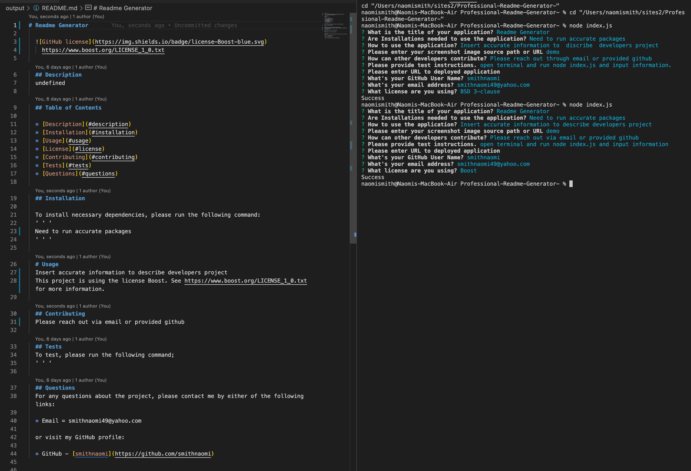

# Readme Generator

_Naomi Smith_

https://opensource.org/licenses/EPL-1.0

## Description

Developers are able to create a Readme that describes their application using Markdown. Developers have the ability to describe the application, how to use it, needed installation, how to contribute and report concerns.

## Table of Contents

- [Description](#description)
- [Installation](#installation)
- [Usage](#usage)
- [License](#license)
- [Contributing](#contributing)
- [Tests](#tests)
- [Questions](#questions)

## Installation

Install accurate packages

# Usage

## Contributing

Please reach out via email and provided Github

## Tests

Clone repository and open integrated terminal and run node index.js

## Questions

For any questions about the project, please contact me by either of the following links:

- Email = smithnaomi49@yahoo.com

or visit my GitHub profile:

- GitHub - [smithnaomi](https://github.com/smithnaomi)
